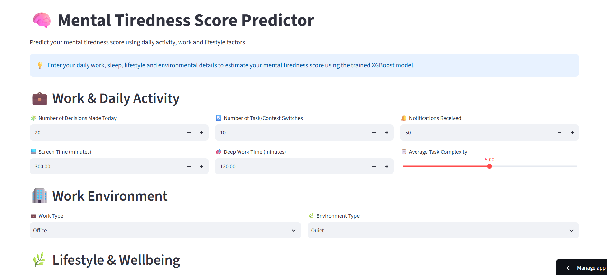
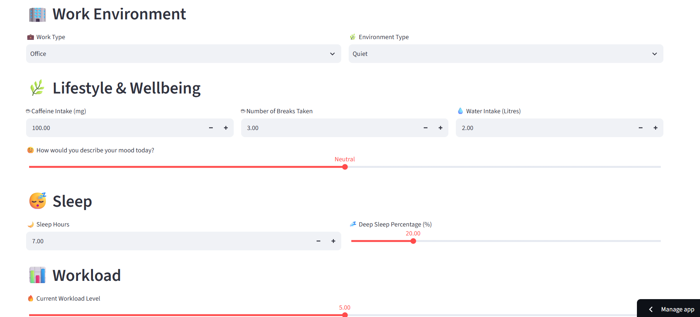
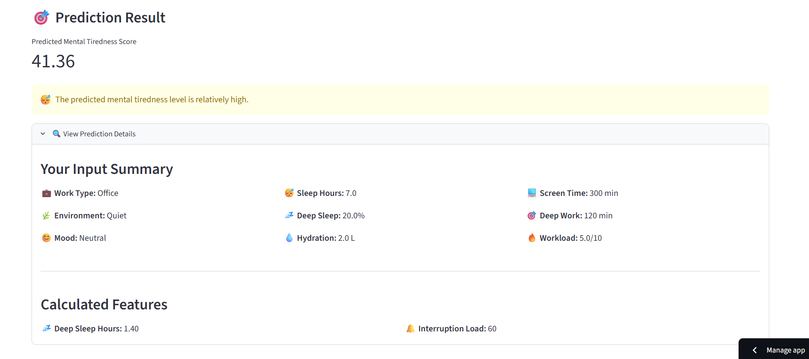
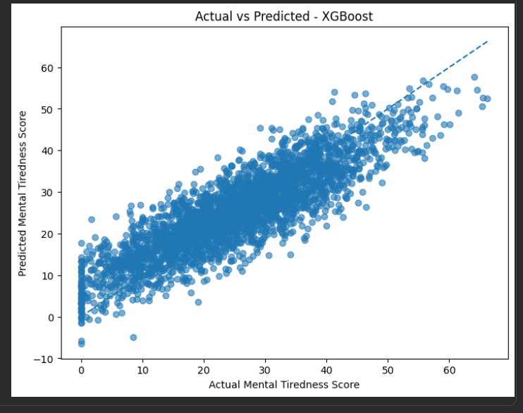
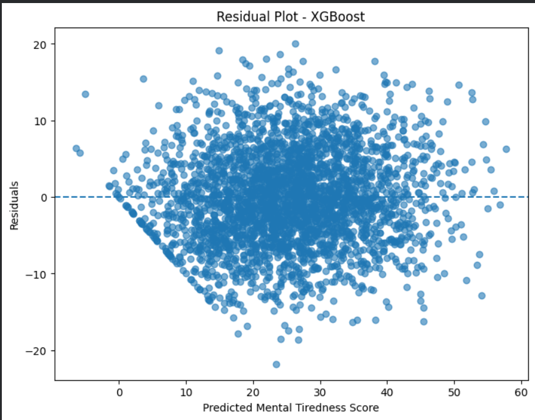

# 🧠 Mental Tiredness Score Prediction

A machine learning project that predicts a person's mental tiredness score based on daily work activity, lifestyle, sleep, workload and environmental factors.


## 🚀 Live Demo

🔗 Streamlit App: https://mental-tiredness-score-predict-ml-project.streamlit.app

---

## 📌 Project Overview

Mental tiredness can be influenced by several factors such as workload, screen time, number of decisions made, task switching, sleep, hydration, caffeine intake and environmental conditions.

This project uses machine learning to predict a continuous Mental Tiredness Score from these factors.

The project was developed using Python and several regression algorithms, with XGBoost selected as the final model based on its evaluation performance.

---

## 🎯 Objective

The main objective of this project is to:

- Analyze the relationship between different features and mental tiredness.
- Identify important factors associated with mental tiredness.
- Compare different regression models.
- Select the best-performing model based on evaluation metrics.
- Deploy the final model using Streamlit.

---

## 🛠️ Technologies Used

- Python
- Pandas
- NumPy
- Scikit-learn
- XGBoost
- Matplotlib
- Streamlit
- Jupyter Notebook
- GitHub

---

## 🔎 Exploratory Data Analysis

The dataset was explored to understand its structure and identify patterns in the data.

The analysis included:

- Dataset structure and data types
- Summary statistics
- Missing value analysis
- Duplicate checking
- Distribution analysis
- Feature relationships
- Correlation analysis
- Outlier detection
- Data visualization

## 🧹 Data Preprocessing

The following preprocessing steps were performed:

- Checked for missing values.
- Checked for duplicate records.
- Examined feature data types.
- Analyzed and handled outliers.
- Prepared the features for Machine Learning.
- Prepared the target variable for regression.

## ⚙️ Feature Engineering

Additional features were created to provide the model with more meaningful information.

### Deep Sleep Hours

Deep sleep hours were calculated using:

Deep Sleep Hours = Sleep Hours × Deep Sleep Percentage / 100

### Interruption Load

An interruption-related feature was created using:

Interruption Load = Context Switch Count + Notifications Received

These engineered features were used during model training and prediction.

## 📊 Features Used

The model uses the following features:

- Number of Decisions Made
- Context Switch Count
- Notifications Received
- Screen Time
- Deep Work Time
- Average Task Complexity
- Caffeine Intake
- Break Frequency
- Deep Sleep Percentage
- Hydration
- Mood
- Work Type
- Noise Level
- Workload Score
- Deep Sleep Hours
- Interruption Load

---

## 🤖 Machine Learning Models

Several regression algorithms were evaluated:

- Linear Regression
- Ridge Regression
- Decision Tree
- Random Forest
- K-Nearest Neighbors (KNN)
- Support Vector Regression (SVR)
- XGBoost

---

## 📈 Model Evaluation

The models were evaluated using:

- RMSE (Root Mean Squared Error)
- MAE (Mean Absolute Error)
- R² Score
- MSE (Mean Squared Error)

### Model Comparison

| Model | RMSE | MAE | R² Score | MSE |
|---|---:|---:|---:|---:|
| XGBoost | 6.1653 | 4.9232 | 0.7449 | 38.0106 |
| SVR | 6.1961 | 4.9295 | 0.7424 | 38.3912 |
| Ridge | 6.6082 | 5.3015 | 0.7070 | 43.6680 |
| Linear Regression | 6.6084 | 5.3017 | 0.7069 | 43.6707 |
| Random Forest | 7.2746 | 5.8242 | 0.6449 | 52.9192 |
| KNN | 7.9405 | 6.3223 | 0.5769 | 63.0521 |
| Decision Tree | 9.3956 | 7.5221 | 0.4077 | 88.2751 |

### 🏆 Selected Model

XGBoost was selected as the final model because it achieved the lowest RMSE and MSE among the evaluated models while also achieving the highest R² score.

### Final XGBoost Performance

- RMSE: **6.1653**
- MAE: **4.9232**
- R² Score: **0.7449**
- MSE: **38.0106**

---

## 📸 Application Screenshots

### 🏠 Home Page - 1



### 🏠 Home Page - 2




### 🎯 Prediction Result

After entering the required information, the application predicts the user's Mental Tiredness Score.



---

## 📊 Model Visualization

### Actual vs Predicted

The Actual vs Predicted plot shows how closely the predicted mental tiredness scores follow the actual scores.




### Residual Plot

The residual plot helps examine the prediction errors of the XGBoost model.



---

## 🌐 Streamlit Application

The trained XGBoost model was deployed using Streamlit.

Users can enter:

- Daily work activity
- Screen time
- Deep work duration
- Sleep information
- Mood
- Workload
- Hydration
- Caffeine intake
- Work environment

The application then predicts the expected Mental Tiredness Score.

---
## 📊 Dataset Resource

The dataset used in this project was obtained from:

🔗 **[Dataset Resource](https://drive.google.com/file/d/1X98TSUfLowKt4F97PyiHxbRg41jZaXb_/view?usp=sharing)**

---
## ▶️ How to Run Locally

### 1. Clone the repository

```bash
git clone YOUR-GITHUB-REPOSITORY-LINK
```
### 2. Navigate to the project folder
```bash
cd Mental-Tiredness-Score-Prediction
```
### 3. Install the required dependencies
```bash
pip install -r requirements.txt
```
### 4. Run the Streamlit application
```bash
streamlit run app.py
```
The application will open in your browser, where you can enter the required details and get the predicted Mental Tiredness Score.

---

## 📂 Project Structure

```text
Mental-Tiredness-Score-Prediction/
│
├── app.py
├── model_pipe.pkl
├── requirements.txt
├── README.md
├── .gitignore
│
├── notebooks/
│   ├── 01_Data_Cleaning_and_EDA.ipynb
│   └── 02_Feature_Engineering_Selection_and_Modeling.ipynb
│
└── screenshots/
    ├── homepage1.png
    ├── homepage2.png
    ├── prediction_result.png
    ├── actual_vs_predicted.png
    └── residual_plot.png
```
          
## 📝 Conclusion

This project developed a machine learning system to predict Mental Tiredness Scores using work activity, lifestyle, sleep, workload, and environmental factors.

Different regression models were trained and evaluated using RMSE, MAE, MSE, and R² Score. Among the evaluated models, XGBoost achieved the best overall performance and was selected as the final model.

The final XGBoost model achieved an R² Score of **0.7449**, with an RMSE of **6.1653** and MAE of **4.9232**.

The trained model was integrated into a **Streamlit web application**, allowing users to enter relevant information and obtain a predicted Mental Tiredness Score through an interactive interface.

This project demonstrates the application of data preprocessing, exploratory data analysis, feature engineering, feature selection, machine learning model comparison, evaluation, and deployment in an end-to-end machine learning project.

## 👩‍💻 Author

**Maneesha Gourigari**

B.Tech – Artificial Intelligence & Machine Learning

📌 **GitHub:** [Maneesha Gourigari](https://github.com/Maneesha7777)

📌 **LinkedIn:** [Maneesha Gourigari](https://www.linkedin.com/in/maneesha-gourigari)
